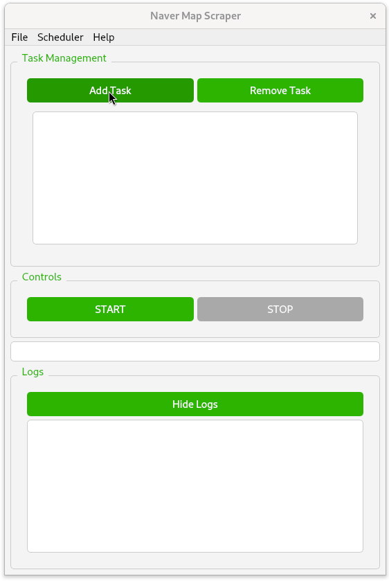
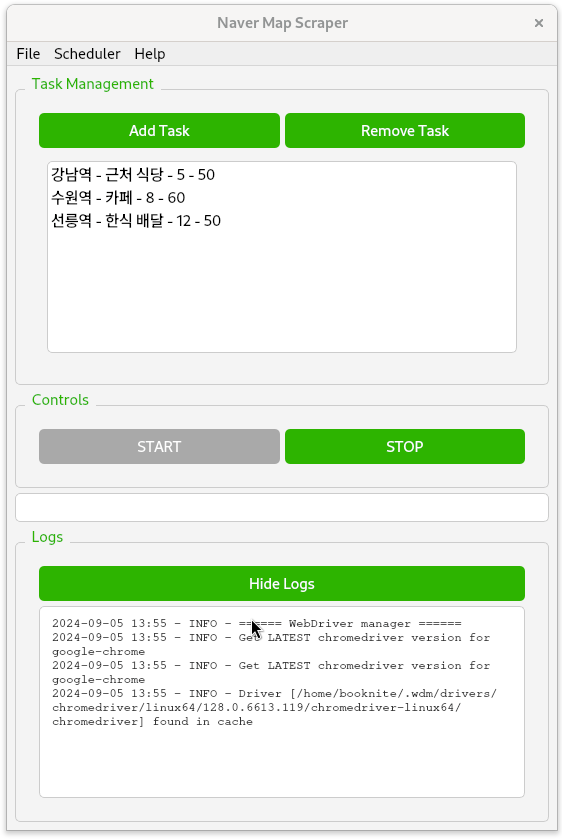

# Naver Map Scraper
This application scrapes restaurant information from Naver Maps, using a graphical interface to manage multiple scraping tasks and export data to Excel format.

## Features
<table>
  <tr>
    <td align="center">
      
       
      <em>GIF 1</em>
    </td>
    <td align="center">
      
       
      <em>GIF 2</em>
    </td>
  </tr>
</table>

* Scrapes restaurant name, address, and phone number from Naver Maps
* GUI for managing multiple scraping tasks across different locations
* Customizable search parameters (address, category, number of restaurants, zoom level)
* Scrape multiple locations as subsequent tasks
* Save and load task lists as .json files for repeated use
* Real-time progress tracking
* Data export to neatly formatted Excel files
* Graceful stop functionality, saving partial data if interrupted

## Setup
### Prerequisites
1. Python 3.7+
2. Required packages (install via `pip install -r requirements.txt`):
   - PyQt5
   - selenium
   - beautifulsoup4
   - openpyxl
   - webdriver_manager
   - Chrome Browser (latest version)

## Usage
1. Run the application: python3 naver-scraper.py
2. Add scraping tasks using the 'Add Task' button.
3. Click 'START' to begin scraping. Progress is shown in real-time.
4. Use 'STOP' to halt the process (partial data will be saved).
5. Scraped data is automatically saved as Excel files.

### File Management
- Default Excel filename: "naver_restaurants_data.xlsx"
- Default save location: Current working directory
- Each task creates a new sheet in the Excel file
- Sheet naming: "{address} - {search query}" (truncated if > 31 characters)
- Change save location: File > Change Save Location
- Rename output file: File > Rename Output File
- Save/load task lists: Scheduler menu (.json file)

## Author
[booknite]

## License
This project is licensed under the MIT License.

